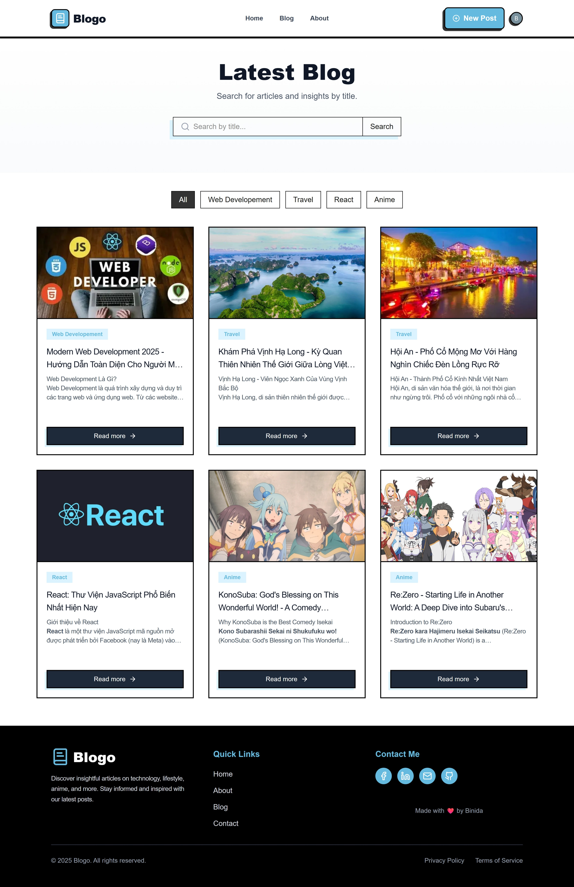

# Blogo

A simple blogging website built with Next.js 15.

**Live:** [binida2k1.vercel.app](https://binida2k1.vercel.app)

## What's This?

A blog platform where you can write and share articles. Has admin panel to manage posts.

## Main Features

- Write blog posts with rich text editor
- Upload images
- User login system
- Search and filter posts
- Share on social media
- Mobile friendly

## Built With

- Next.js 15
- MongoDB (database)
- Clerk (login system)
- Cloudinary (image storage)
- Tailwind CSS (styling)

## Setup

1. Download code

```bash
git clone https://github.com/Binida1210/next_blog.git
cd next_blog
npm install
```

2. Add `.env.local` file with your keys

```env
MONGODB_URI=your_database_url
NEXT_PUBLIC_CLERK_PUBLISHABLE_KEY=your_clerk_key
CLERK_SECRET_KEY=your_secret
CLOUDINARY_CLOUD_NAME=your_cloudinary_name
CLOUDINARY_API_KEY=your_api_key
CLOUDINARY_API_SECRET=your_secret
```

3. Run

```bash
npm run dev
```

Visit: http://localhost:3000

## Deploy

Push to GitHub, then deploy on Vercel. Add the same environment variables there.

## Screenshots

### Home Page



### Blog Detail


### Admin Dashboard


## License

Free to use (MIT)
